# E-Corona Project
project description to the project for DBMS3.
## Phase 2 : Project description and data preparation 
<details>
  <summary>Project goal and its applications, benefits in real world.</summary>
  <p>Due to recent news, the consequences of which have affected not only our country but also the life cycle and economies of all countries in the world - the emergence of the highly dangerous Covid-19 virus - it has become very difficult to care for all patients at once. This is due not only to the fact that the number of medical personnel is insufficient to serve all patients over time but also to the fact that doctors have to work hard to serve and not get infected by the virus from a patient, as many still do not understand the seriousness of the disease. 
Our project proposes to solve this essentially the very serious problem with the help of online consultations with doctors, who will help those who are not seriously ill (i.e. asymptomatically, for example) or people who have already contracted the virus, maintain their health and make sure that they do not re-infected when the immunity of the infected person decreases.</p>
  <p>Website will enable people who are mildly ill, as well as those who have contracted the virus, to monitor their health online, without visiting doctors in hospitals, thus reducing the risk of falling ill again or infecting more healthy people who may be in their way. We have gathered the most experienced doctors, clinics, contacts, answers to frequently asked questions and want to make a unique platform for maintaining the health of our citizens into the Oracle database, also we have put together appropriate queries that will make it easier for visitors to the website to find the information they need quickly and conveniently.
Key Terms: the convenience of finding the right information in one place, avoiding unnecessary physical contact, the position of starting online medical consultations, and using the Oracle database.</p>
</details>
<details>
  <summary>Scope of the project</summary>
  <p>Collect all necessary data, parse it, implement all functions and procedures to properly operate with data.
- Objectives: 
Collect of medical centers in all cities of Kazakhstan
Collect of infectious diseases doctors from each medical center
Collect places to take the PCR test
Processing frequently asked questions by searching among users
Create an opportunity for the user to make an appointment online for an infectious diseases doctor, take a PCR test.</p>
</details>
<details>
  <summary>Type of the user-interface</summary>
  <p>We have chosen a format of web application for our project. And to connect the interface with the database we are going to use PHP as a programming language. PHP uses the standard Oracle functions (ORA) and the interface to access Oracle functions (OCI), which makes it possible to use all the features of Oracle, including PL/SQL.</p>
</details>
<details>
  <summary>Programming Language and database server</summary>
  <p>Methods: 
To start with, we used PHP to develop the backend side of the website.
A quick overview: PHP uses the standard Oracle functions (ORA) and the interface to access Oracle functions (OCI), which makes it possible to use all the features of Oracle, including PL/SQL.
Even though connecting PHP to Oracle did not seem so complicated, we were somewhat puzzled by the discrepancy between our database version and the XAMPP version of the database. 
At the end we opened our connect.php file and wrote the following command there:

```php
<?php
// Create connection to Oracle
$conn = oci_connect("ecoron", "qwerty123", "//localhost/orcl");
if (!$conn) {
   $m = oci_error();
   echo $m['message'], "\n";
   exit;
}
else {
   print "Connected to Oracle!";
}
// Close the Oracle connections
oci_close($conn);
?>
```
PHP - backend;
Front-end starter pack (HTML,CSS + Bootstrap 4);
Database server: XAMPP.</p>
</details>

## Phase 3 : Project Use-Case diagram and questions over the data 
<details>
  <summary>General questions</summary>
  
    1. What if a user wants to get the list of all medical Centers?
    2. What if a user wants to authorize from a non-email format?
    3. How can we delete user’s data from all tables at once?
    Suppose, we have to delete user with id = 10123. Tables, where user_uid can be found: eco_users,online_consultation, online_pcr.
    4. How can a user be added to consultation with a doctor?
    5. How can a user be added to PCR testing in a country's medical centers? 
    6. How can we get list of users?
    7. How can we get list of consultations?
    8. How can we find phone numbers of patient knowing his first name and last name?
    9. How can we insert(register) new users?
    10. What are the first names and city of user who asked a question on 2nd March on the topic of “Doctors”? (knowing that only one question was asked on that day)?
    11. How can we display all questions and answers added by definite admin?
    12. How can we count number of medical consultations and PCR tests of one user in one query?
    13. How to get info about of medical centers near your home (name, full address, contacts) knowing only the name of street?
    14. What are name, address, contacts and test cost of PCR centers in Almaty where cost of one PCR test is less that 15 000 tenge?
    15. Suppose, patient was registered to online consultation. How to recognize doctor's name,workplace and experience knowing only consultation id?

</details>

<details>
  <summary>Dataset for Project</summary>
  <p>
Let's move on to how we will insert data into tables. It's simple, in SQL developer 19 version, there is a built-in function called import, through which we were able to select our own .xslx file with data and import it into tables. After our table was created, we manually set sequence, primary and foreign keys.
It helped us to think through the logic and development of the functionality - drawing up an ERD chart where we listed the name of the tables, the logic through which they are linked to each other (foreign key), and how they can play into our hands in sorting the necessary information when searching.

**Link for ERD in the data repository of the organization:** https://drive.google.com/file/d/15FY00Wvso8Xn8z0YphSSC8LoMxXv4kQP/view

**Link for dataset which will be used in project:** https://docs.google.com/spreadsheets/d/1YsA53Bu3LX_XLowugBjd5CJlRYzsj_NnvpWKkGmVC50/edit?usp=sharing

Reason why we have chosen to generate our own dataset - we want to make project realistic and use data from official websites of medical webpages of Kazakhstan Medical Organizations.
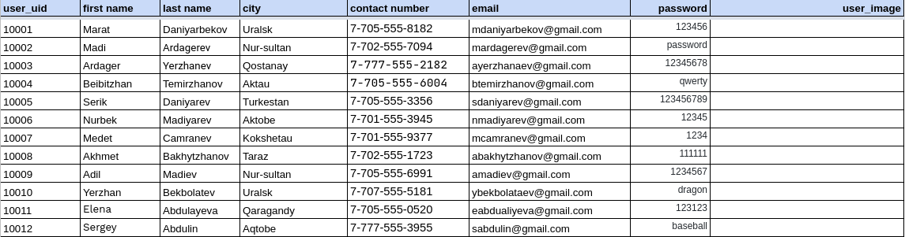
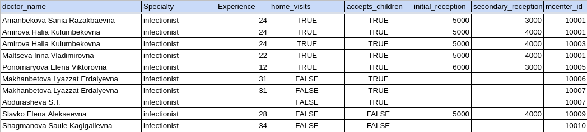
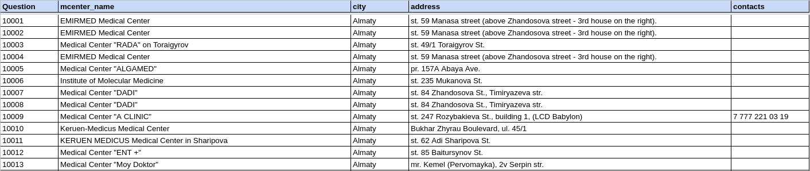
  </p>
  
    **Data about the medical centers:**
    - mcenter_id NUMBER(4) **primary key** - medical center’s identifier
    - mcenter_name VARCHAR2(100) - medical center’s name
    - city VARCHAR2(50) - the city where the medical center locates
    - address VARCHAR2(100) - address of the medical center
    - contacts NUMBER(11) - the contact number of the medical center
    **Data about the doctors:**
    - doctor_id NUMBER(5) **primary key** - doctor’s identifier
    - doctor_name VARCHAR2(100) - doctor’s full name
    - speciality VARCHAR2(100) - the field on which doctor specializes 
    - experience NUMBER(2) - number of years on work
    - home_visits BOOLEAN - if the doctor accepts the patients at home
    - accepts_children BOOLEAN - if the doctor accepts the children in therapies
    - initial_reception NUMBER(6) - the price for very first therapy
    - secondary_reception NUMBER(6) - the price for therapy
    - mcenter_id NUMBER(4) **foreign key** - identifier of medical center where doctor works
    **Data about the PCR:**
    - center_id NUMBER(4) **primary key** - test accepting center’s identifier
    - city VARCHAR2(50) - the city where test accepting center locates
    - center_name VARCHAR2(100) - test accepting center’s name
    - address VARCHAR(100) - address of the test accepting center
    - cost NUMBER(6) - cost of the test
    - webpage VARCHAR2(100) - web page of test accepting center
    - contacts NUMBER(11) -  the contact number of the test accepting center 
    - additional_inf VARCHAR2(100)- additional information on test accepting center
    - queues VARCHAR2(100) - information about queues to test
    - fax NUMBER(11) - the fax number of the test accepting center
    **Data about the FAQ:**
    - question_id NUMBER(4) **primary key** - questions’s identifier
    - question VARCHAR2(1000)- the question which is frequently asked
    - answer VARCHAR2(1000) - answer to the question
    - admin_id NUMBER(2) **foreign key** - admin, who have edited FAQ

    **Data about News:**
    - topic VARCHAR2(500) - main topic
    - thesis VARCHAR2(1000) - content data
    - admin_id NUMBER(2) **foreign key** - admin id
    - news_image BLOB - new's image

    **Data about Admins**
    - first_name VARCHAR2(50) **primary key** - admin name
    -last_name VARCHAR2(50) - admin surname
    - email VARCHAR2(50) - contact email
    - password VARCHAR2(20) - password

    **Data about Users:**
    - user_uid NUMBER (5) NOT NULL **primary key** - user id
    - first_name VARCHAR2 (50) - user name
    - last_name VARCHAR2 (50) - user surname
    - city VARCHAR2 (50) - user city
    - contact_number NUMBER (11) - contact number
    - email VARCHAR2 (50) - contact emil
    - password VARCHAR2 (50) - password
    - profile_image BLOB - user's image

    **Data about Online Consultation:**
    - consultation_id NUMBER(5) **primary key** - record id
    - user_uid NUMBER(5) **foreign key** - user id
    - doctor_id NUMBER(5) **foreign key** - doctor id
    - first_name VARCHAR2(26) - name
    - last_name VARCHAR2(256) - surname
    - age NUMBER(6) - age
    - phone VARCHAR2(128) - contact number
    - city VARCHAR2(128) - city
    - doctor_name VARCHAR2(256) - doctor's name
    - clinics VARCHAR2(1024) - medical institution
    - consultation_date VARCHAR2(256)) - consultation date

    **Data about Online PCR:**
    - pcr_id NUMBER(5) **primary key** - pcr record id
    - center_id NUMBER(4) **foreign key** - center id
    - user_uid NUMBER(5) **foreign key** - user id
    - first_name VARCHAR2(26) - name
    - last_name VARCHAR2(256) - surname
    - city VARCHAR2(128) - city
    - punkt VARCHAR2(1024) - point
    - pcr_date VARCHAR2(256)) - pcr date
</details>

<details>
  <summary>Functionalities and Features of the project</summary>

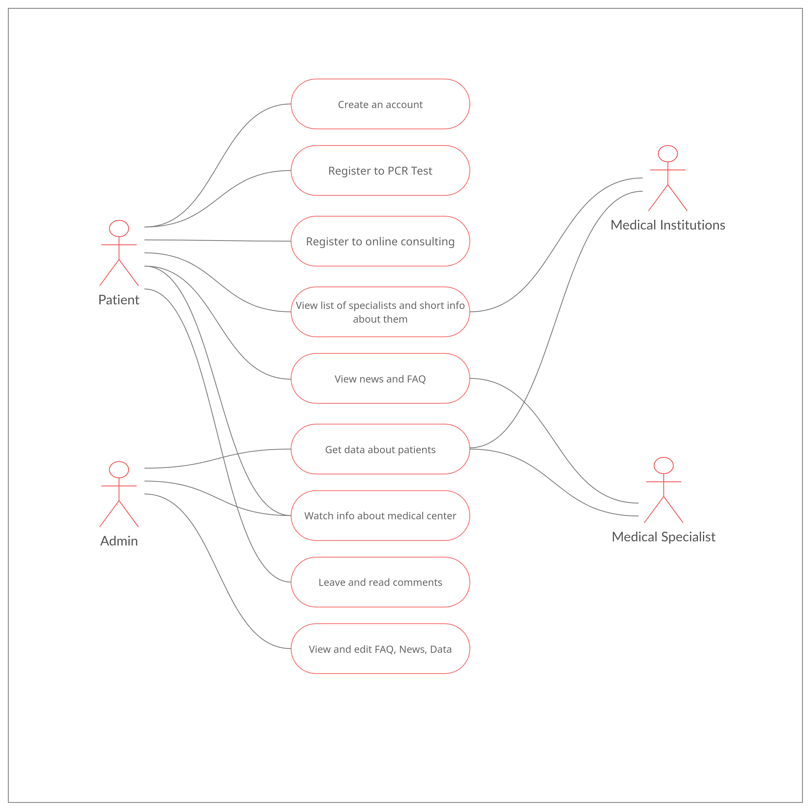
  <p>The E-Corona platform allows a physician to remotely analyze medical records and identify a patient into one of the rehabilitation groups of patients with common problems. Professional rehabilitation instructors then conduct group physical therapy programs, group and individual psychotherapy sessions, art and occupational therapy to correct neurological and mental disorders in a remote mode. Also, the platform provides registration for PCR test, with the ability to find a link to the online record in the right-center, in the right city without unnecessary search, because if you choose correctly, the platform will provide the necessary links to the PCR test in seconds.
  </p>
</details>

## Phase 4 : Data modeling and database design.
<details>
  <summary>ER Diagram. DDL queries.</summary>

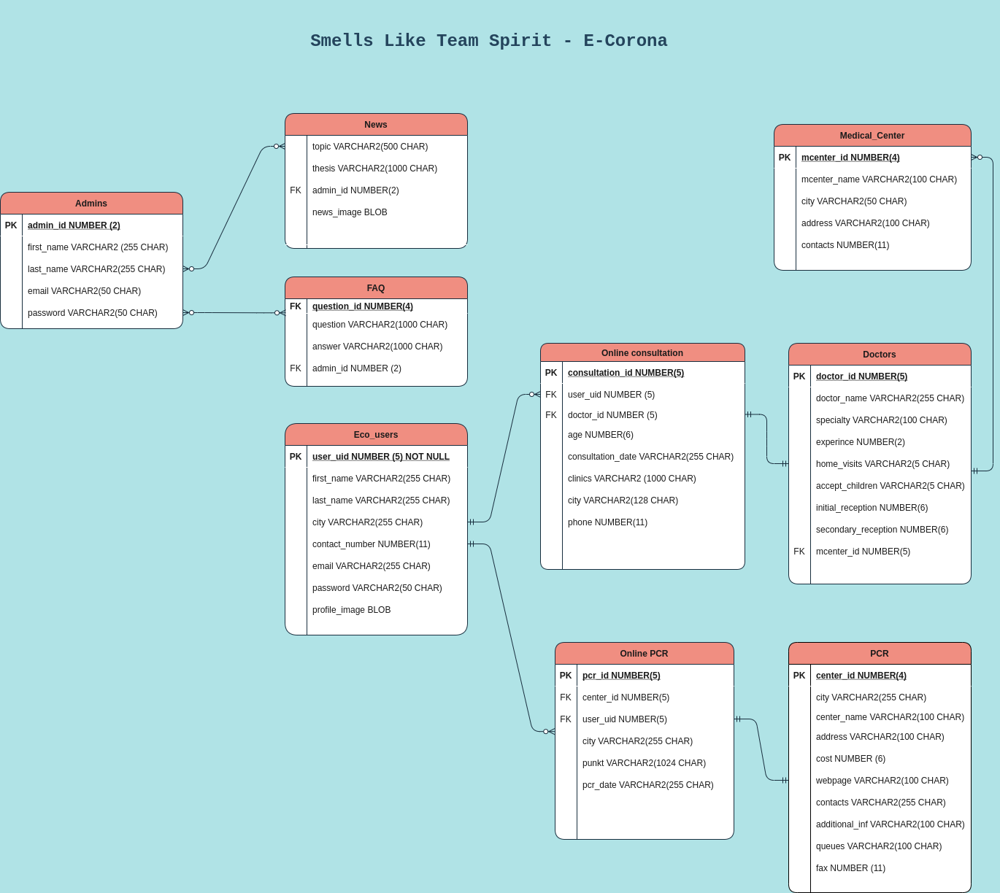 We have used relations: one-to-many, many-to-many.
    
<p>There are 3 different types of relations in the database:
- one-to-one
- one-to-many
- many-to-many

But, since we have the closest links between the data of each table (getting the data from one table via foreign key from another table), there was no chance to use just one-to-one relations (for that moment exactly, at least).

- one admin can edit many news or not;
- one admin can add faq;
- vice versa admin is able to do not add the data to faq;
- one or many users can be on online consultation many times, and doctor can consult one or many users from many cities;
- vice versa one or many users may have not been on consultation and doctor may have not been asked to present on consultation of one or many users;
- one doctor can work in different medical centers at the same time, so it is necessary to write down 2 different datas with 2 different medical_center id's;
- vice versa one or many medical centers may or may not have one or many doctors in their databases;
  </p>
</details>

<details>
  <summary>Data Insertion. DML data load.</summary>

At the data inserting process from excel to database tables we have used "Import" function in SQL Developer:
- right click on table;
- choosing option "import";
- and then step by step actions, that we have represented here:
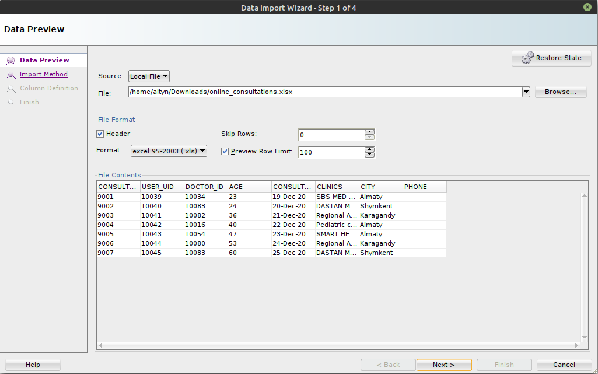
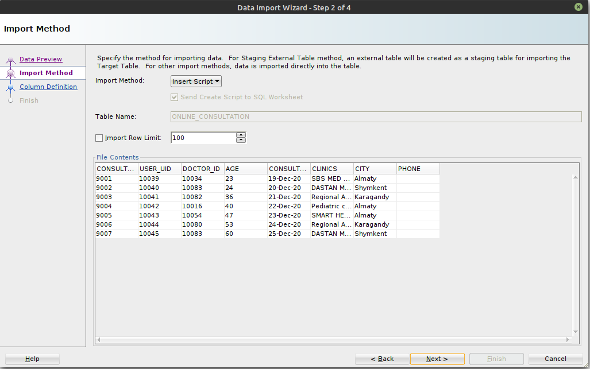
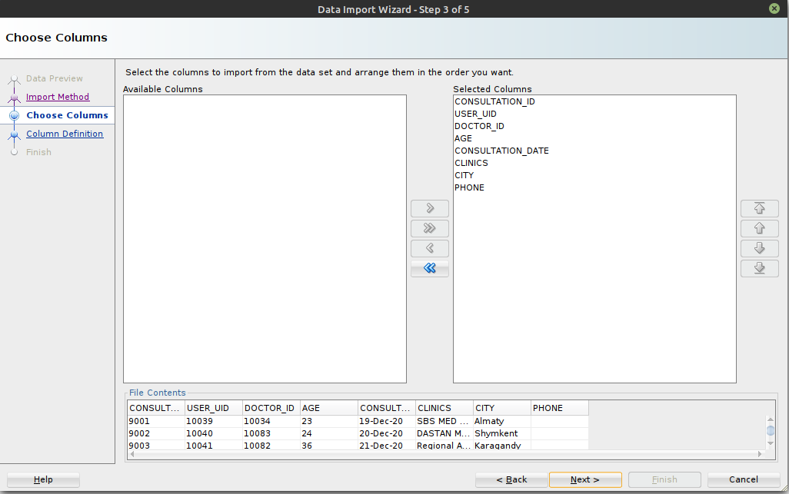
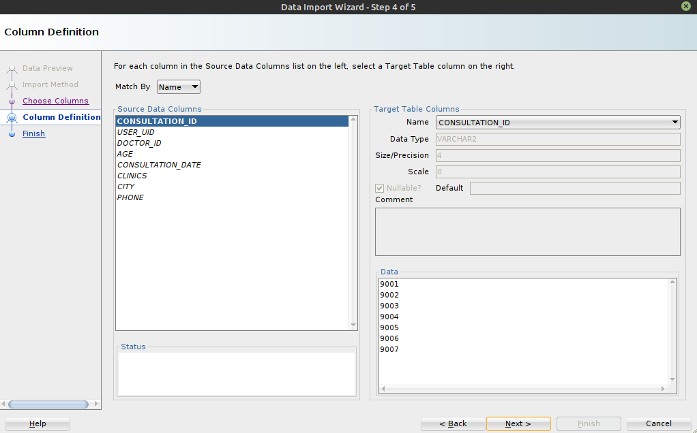
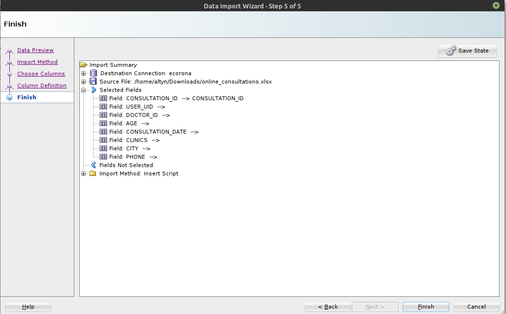
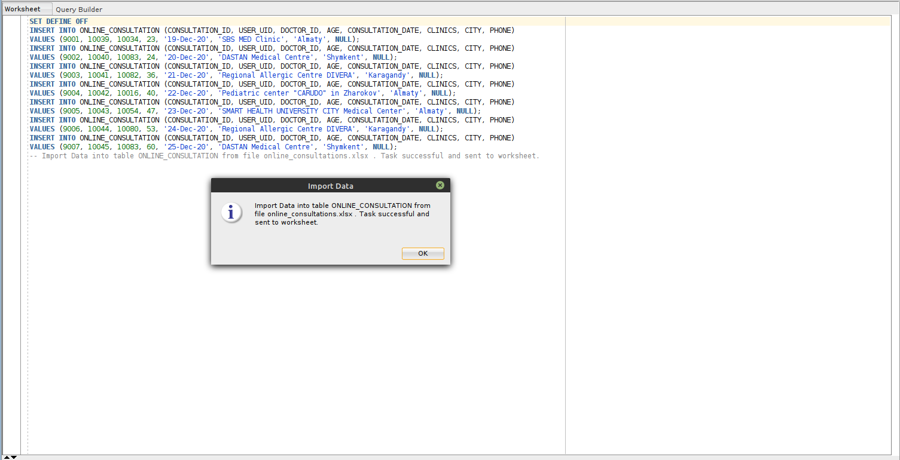
<p>
Also, have tried to use "insert script" to get the full queries of inserted data. Uploaded file (SmellsLikeTeamSpirit-DML-data-load.sql) at the same folder.
  </p>
</details>

## Phase 5 : SQL queries
<details>
  <summary>Link for queries</summary>

All queries are available in [queries](https://github.com/E-CORONA/data/tree/main/queries) folder.
</details>

##  Phase 6 : User-interface implementation and connection 
<details>
  <summary>User Interface</summary>
</details>
<details>
  <summary>Establishing the connection with created database</summary>
</details>
<details>
  <summary>Project functions that will trigger corresponding SQL queries to retrieve the necessary data</summary>
</details>
<details>
  <summary>Display (or vizualize) the retrieved data to the users (or clients)</summary>
</details>
